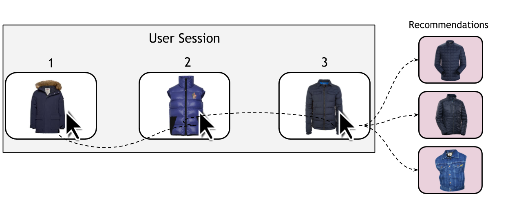

# Comprehensive Benchmarking of Session-based Recommendation using Deep-Learning Approaches

<div style="text-align: center">

</div>
In this repository, we present a comprehensive evaluation of the state-of-the-art deep learning approaches used in session-based recommendation. Our experiments compares between baseline techniques like nearest neighbors and pattern mining algorithms, and deep learning approaches including recurrent neural networks, graph neural networks, and attention based networks. It has been shown that advanced neural network models outperformed the baseline techniques in most of the scenarios however they still suffer more in case of cold start problem. This repo contains the implementations of different algorithms used in our experiments, survey of session-based recommendation papers, and a summary of the paper resources, and results.

## This work was done in <a href = "http://icv.tuit.ut.ee/">iCV Lab</a>, University of Tartu:
<div style="text-align: center">
<a href = "http://icv.tuit.ut.ee/"> </a>
</div>

## Funded by Rakuten , Inc. (grant VLTTI19503):
<div style="text-align: center">
 
</div>

<hr>

## Table of Contents & Organization:
This repository will be organized into the following sections:
+ [List of Papers](#list-of-papers)
  - [Surveys and Benchmarks](#surveys-and-benchmarks)
  - [Baseline Methods](#baselines)
  - [Deep Learning in Generalized Session-based Recommendation](#deep-learning-in-generalized-session-based-recommendation)
  - [Deep Learning in Personalized Session-based Recommendation](#deep-learning-in-personalized-session-based-recommendation)
+ [Survey of Deep-Learning Approaches in session-based recommendation](#survey-of-deep-learning-approaches-in-session-based-recommendation)
+ [E-Commerce Session-based Recommendation Datasets](#e-commerce-session-based-recommendation-datasets)
+ [Citation](#citation)

<hr>

## List of Papers

+ ### Surveys and Benchmarks
  - 2005 | Toward the next generation of recommender systems: A survey of the state-of-the-art and possible extensions. | IEEE Transactions | [`PDF`](http://pages.stern.nyu.edu/~atuzhili/pdf/TKDE-Paper-as-Printed.pdf)
  - 2017 | A Comparison of Frequent Pattern Techniques and a Deep Learning Method for Session-Based Recommendation. | RecSys | [`PDF`](http://ceur-ws.org/Vol-1922/paper10.pdf)
  - 2018 | Sequence-aware recommendersystems  | ACM CSUR | [`PDF`](https://arxiv.org/pdf/1802.08452.pdf)
  - 2018 | Evaluation of session-based recommendation algorithms. | Journal of User Modeling and User-Adapted Interaction. | [`PDF`](https://arxiv.org/pdf/1803.09587.pdf)
  - 2019 | A Survey on Session-based Recommender Systems. | ArXiv | [`PDF`](https://arxiv.org/abs/1902.04864)
  - 2019 | Sequential Recommender Systems: Challenges, Progress and Prospects. | ArXiv | [`PDF`](https://arxiv.org/ftp/arxiv/papers/2001/2001.04830.pdf)
  - 2020 | Empirical Analysis of Session-Based Recommendation Algorithms | ArXiv |  [`PDF`](https://arxiv.org/pdf/1910.12781.pdf)
  
+ ### Baselines
  - 1993 | Mining association rules betweensets of items in large database | SIGMOD | [`PDF`](https://rakesh.agrawal-family.com/papers/sigmod93assoc.pdf)
  - 2009 | BPR: Bayesian Personalized Ranking from Implicit Feedback. | UAI | [`PDF`](https://arxiv.org/abs/1205.2618)
  - 2010 | Factorizing Personalized Markov Chains for Next-basket Recommendation. | WWW | [`PDF`](https://www.ismll.uni-hildesheim.de/pub/pdfs/RendleFreudenthaler2010-FPMC.pdf)
  - 2013 | FISM: factored item similarity models for top-n recommender systems. | SIGKDD | [`PDF`](http://glaros.dtc.umn.edu/gkhome/fetch/papers/fismkdd13.pdf)
  - 2015 | Adapting recommen-dations to contextual changes using hierarchical hidden markov models. | RecSys | [`PDF`](https://dl.acm.org/citation.cfm?id=2799684)
  - 2016 | Fusing  similarity  models  with  markov  chains  forsparse sequential recommendation. | ICDM | [`PDF`](https://arxiv.org/abs/1609.09152)
  - 2016 | Item2vec: Neural item embedding for collaborative filtering.| ArXiv | [`PDF`](http://arxiv.org/abs/1603.04259)
  - 2018 | Evaluation of session-based recommendation algorithms. | Journal of User Modeling and User-Adapted Interaction. | [`PDF`](https://arxiv.org/pdf/1803.09587.pdf)
  
+ ### Deep Learning in Generalized Session-based Recommendation
  - 2015 | Session-based recom-mendations with recurrent neural networks. | (GRU4Rec) | ArXiv | [`PDF`](https://arxiv.org/abs/1511.06939)
  - 2016 | Parallel Recurrent Neural Network Architectures for Feature-rich Session-based Recommendations. | (P-GRU4Rec) | RecSys | [`PDF`](https://dl.acm.org/doi/10.1145/2959100.2959167)
  - 2017 | 3d convolutional networks for session-based recommendation with content features. | (3D-CNN) | RecSys | [`PDF`](https://cseweb.ucsd.edu/classes/fa17/cse291-b/reading/p138-tuan.pdf)
  - 2017 | Neural attentive session-based recommendation. | (NARM) | CIKM | [`PDF`](https://arxiv.org/pdf/1711.04725.pdf)
  - 2018 |  Recurrent neural networks with top-k gains for session-based recommendation. | (GRU4Rec+) | CIKM | [`PDF`](https://arxiv.org/abs/1706.03847)
  - 2018 | STAMP: Short-Term Attention/Memory Priority Model for Session-based Recommendation. | (STAMP) | KDD | [`PDF`](https://www.kdd.org/kdd2018/accepted-papers/view/stamp-short-term-attentionmemory-priority-model-for-session-based-recommend)
  - 2019 | Simple convolutional generative network for next item recommendation. | (NextItNet) | WSDM | [`PDF`](https://arxiv.org/pdf/1808.05163.pdf)
  - 2019 | Session-based recommen-dation with graph neural networks. | (SRGNN) | AAAI | [`PDF`](https://arxiv.org/abs/1811.00855)
  - 2019 | A collaborativesession-based recommendation approach with parallel memory modules. | (CSRM) | SIGIR | [`PDF`](https://dl.acm.org/doi/10.1145/3331184.3331210)
  - 2019 | A Repeat Aware Neural Recommendation Machine for Session-based Recommendation. | (RepeatNet) | AAAI | [`PDF`](https://staff.fnwi.uva.nl/m.derijke/wp-content/papercite-data/pdf/ren-repeatnet-2019.pdf)
  - 2019 | A Dynamic Co-attention Network for Session-based Recommendation. | (DCN-SR) | CIKM | [`PDF`](https://dl.acm.org/doi/10.1145/3331184.3331210)
  
 + ### Deep Learning in Personalized Session-based Recommendation
   - 2017 | Personalizing session-based recommendations with hierarchical recurrent neural networks. | (HRNN) | RecSys | [`PDF`](https://arxiv.org/pdf/1706.04148.pdf)
   - 2017 | Inter-session modeling for session-based recommendation. | (IIRNN) | RecSys | [`PDF`](https://dl.acm.org/doi/10.1145/3125486.3125491)
   - 2018 | Self-attentive sequential recommendation. | (SASRec) | ICDM | [`PDF`](https://arxiv.org/pdf/1808.09781.pdf)
   - 2018 | Personalized  top-n  sequential  recommendation  via convolutional  sequence  embedding. | (CASER) | WSDM | [`PDF`](https://dl.acm.org/doi/10.1145/3159652.3159656)
   - 2019 | Bert4rec: Sequential recommendation with bidirectional encoder representations from trans-former. | (BERT4Rec) | CIKM | [`PDF`](https://arxiv.org/pdf/1904.06690.pdf)
  <hr>

## Survey of Deep-Learning Approaches in session-based recommendation
  
| Model Name | Date |       Framework       | Personalized<br>Recommendation |                         Open Source                         |                                           Our Code                                           |
|:----------:|:----:|:---------------------:|:------------------------------:|:-----------------------------------------------------------:|:--------------------------------------------------------------------------------------------:|
|   GRU4Rec  | 2015 |         Theano        |                ×               |        [`Github`](https://github.com/hidasib/GRU4Rec)       |                                               -                                              |
|  P-GRU4Rec | 2016 |           -           |                ×               |                              ×                              |                                               -                                              |
|   3D-CNN   | 2017 |           -           |                ×               |                              ×                              |                                               -                                              |
|    NARM    | 2017 |         Theano        |                ×               |   [`Github`](https://github.com/lijingsdu/sessionRec_NARM)  |      [`URL`](https://github.com/mmaher22/iCV-SBR/tree/master/Source%20Codes/NARM_Theano)     |
|    IIRNN   | 2017 |       Tensorflow      |                √               |     [`Github`](https://github.com/olesls/master_thesis)     |                                               -                                              |
|    HRNN    | 2017 |         Theano        |                √               |        [`Github`](https://github.com/mquad/hgru4rec)        |                                               -                                              |
|  GRU4Rec+  | 2018 |         Theano        |                ×               |        [`Github`](https://github.com/hidasib/GRU4Rec)       |   [`URL`](https://github.com/mmaher22/iCV-SBR/tree/master/Source%20Codes/GRU4Rec%2B_Theano)  |
|    STAMP   | 2018 |       Tensorflow      |                ×               |        [`Github`](https://github.com/uestcnlp/STAMP)        |   [`URL`](https://github.com/mmaher22/iCV-SBR/tree/master/Source%20Codes/STAMP_Tensorflow)   |
|   SASRec   | 2018 |       Tensorflow      |                √               |        [`Github`](https://github.com/kang205/SASRec)        |                                               -                                              |
|    CASER   | 2018 |        Pytorch        |                √               |    [`Github`](https://github.com/graytowne/caser_pytorch)   |                                               -                                              |
|  NextItNet | 2019 |       Tensorflow      |                ×               |      [`Github`](https://github.com/fajieyuan/nextitnet)     | [`URL`](https://github.com/mmaher22/iCV-SBR/tree/master/Source%20Codes/NextitNet_Tensorflow) |
|    SRGNN   | 2019 | Tensorflow<br>Pytorch |                ×               |      [`Github`](https://github.com/CRIPAC-DIG/SR-GNN)       |     [`URL`](https://github.com/mmaher22/iCV-SBR/tree/master/Source%20Codes/SRGNN_Pytorch)    |
|    CSRM    | 2019 |       Tensorflow      |                ×               |    [`Github`](https://github.com/wmeirui/CSRM_SIGIR2019)    |    [`URL`](https://github.com/mmaher22/iCV-SBR/tree/master/Source%20Codes/CSRM_Tensorflow)   |
|  BERT4Rec  | 2019 |       Tensorflow      |                √               |        [`Github`](https://github.com/FeiSun/BERT4Rec)       |                                               -                                              |
|   DCN-SR   | 2019 |           -           |                ×               |                              ×                              |                                               -                                              |
|  RepeatNet | 2019 |   Chainer<br>Pytorch  |                ×               | [`Github`](https://github.com/PengjieRen/RepeatNet-pytorch) |                                               -                                              |
<hr>


### E-Commerce Session-based Recommendation Datasets
  - 2015 | YOOCHOOSE - RecSys Challenge | [`URL`](http://2015.recsyschallenge.com/)
  - 2015 | Zalando Fashion Recommendation | [`NA`](https://zalando.com/)
  - 2016 | Diginetica - CIKM Cup | [`URL`](https://cikm2016.cs.iupui.edu/cikm-cup/)
  - 2016 | TMall (Taobao) - IJCAI16 Contest | [`URL`](https://tianchi.aliyun.com/dataset/dataDetail?dataId=53)
  - 2017 | Retail Rocket | [`URL`](https://www.kaggle.com/retailrocket/ecommerce-dataset)

<hr>

## Contribute:  
To contribute a change to add more references to our repository, you can follow these steps:
1. Create a branch in git and make your changes.
2. Push branch to github and issue pull request (PR).
3. Discuss the pull request.
4. We are going to review the request, and merge it to the repository.

<hr>


## Citation:
 For more details, please refer to our benhcmarking Paper [`PDF`](#)
 ```
Maher M. et al., Comprehensive Empirical Evaluation of Deep Learning Approaches forSession-based Recommendation in E-Commerce (2020).
```
